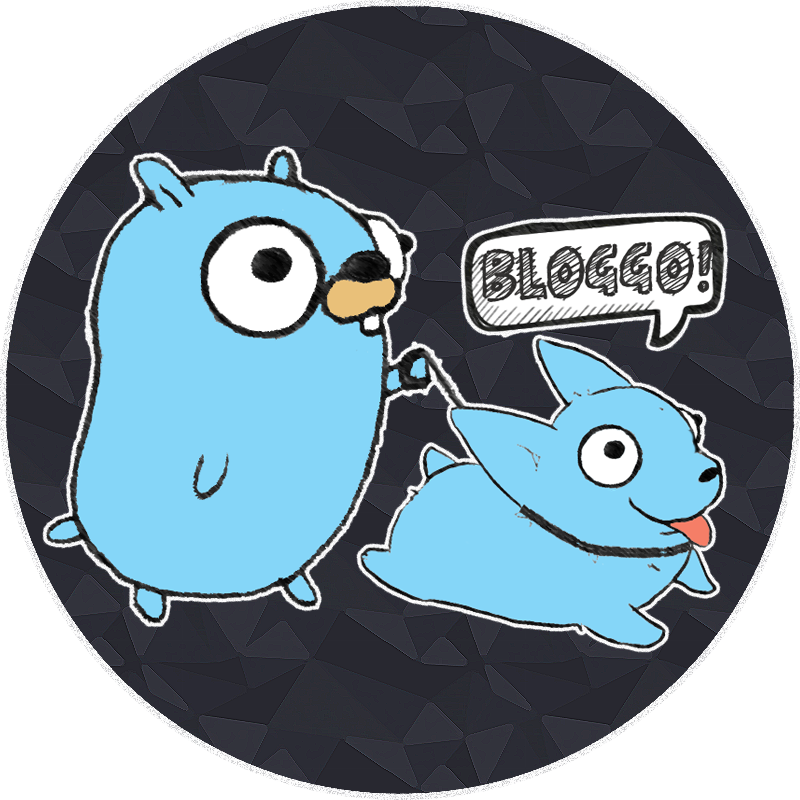
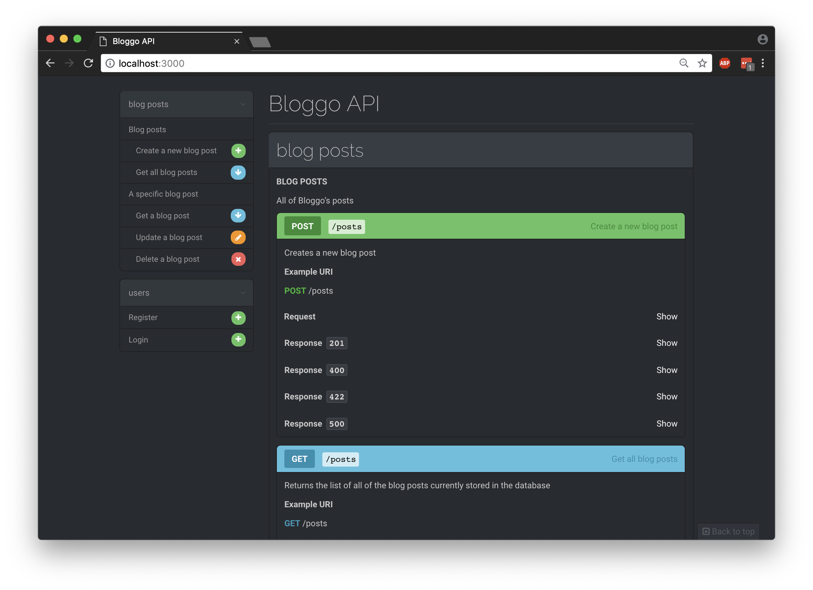
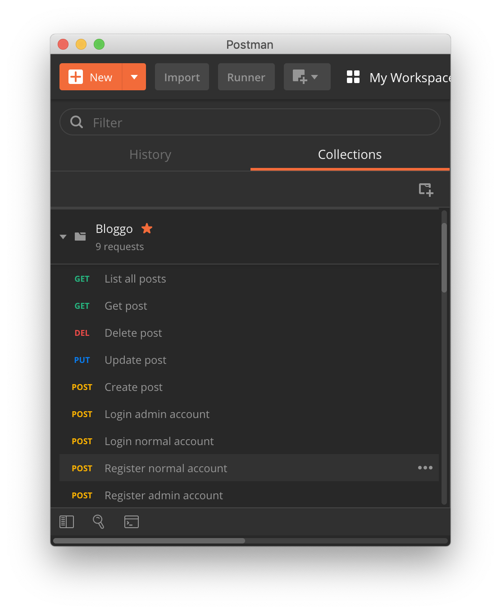
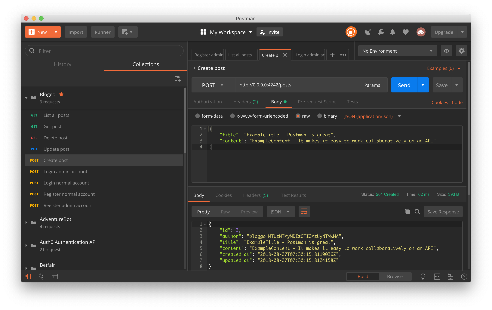
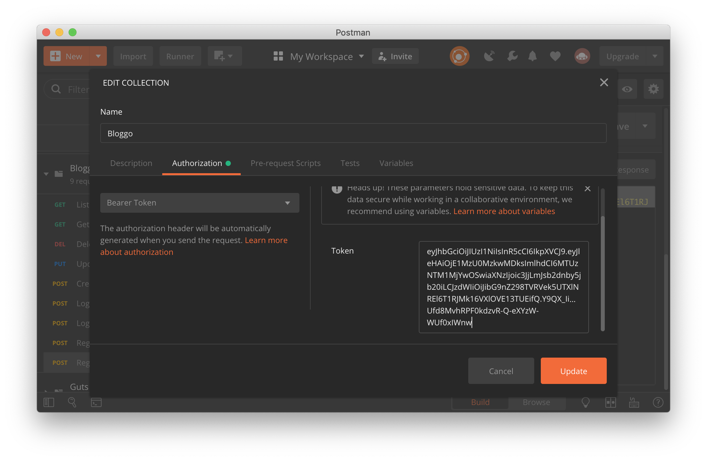
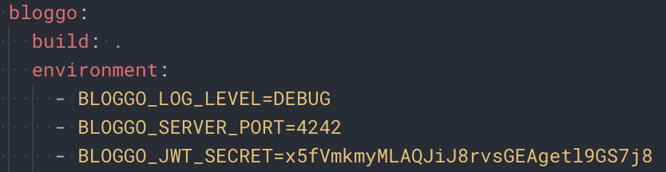

# Bloggo

Bloggo is a self-hosted blogging CMS. Or at least it will be. One day.

The idea is to use a fast and simple language for the backend, Go, and a simple system of CSS Grids for allowing to customize the interface. This way, it makes it easy for everyone to have their own custom blog.

<p align="center">
    
</p>
<p align="center">
    <a href="#license">
        
    </a>
    <a href="https://goreportcard.com/report/github.com/Ullaakut/Bloggo">
        
    </a>
    <a href="https://github.com/Ullaakut/Bloggo/releases/latest">
        
    </a>
    <a href="https://travis-ci.org/Ullaakut/Bloggo">
        
    </a>
    <a href='https://coveralls.io/github/Ullaakut/Bloggo?branch=add-ci'>
        
    </a>
    <a href="https://godoc.org/github.com/Ullaakut/Bloggo">
        
    </a>
</p>

## Table of content

* [How to run it](#how-to-run-it)
* [Configuration](#Configuration)
* [API Blueprints](#api-blueprints)
* [Postman collection](#postman-collection)
* [Testing](#testing)
* [Possible future improvements](#possible-future-improvements)
* [Notes & technical choices](#notes-and-technical-choices)
* [Environment configuration](#environment)
* [License](#license)

## Dependencies

* `docker` [Download](https://www.docker.com/community-edition)
* `docker-compose` [Download](https://docs.docker.com/compose/install/)

## How to run it

* `docker-compose up`

## Configuration

Default configuration:

```json
LogLevel=DEBUG
MySQLRetryDuration=60000
MySQLRetryInterval=2000
MySQLURL=root:root@tcp(db:3306)/bloggo?charset=utf8&parseTime=True&loc=Local
ServerAddress=0.0.0.0
ServerPort=4242
```

Please note that the JWT Secret isn't configured by default and needs to be set for the app to work properly. It is also highly recommended to change the credentials used for the database.

To set the configuration values, you need to set environment variables. See the [environment variables section](#environment). This can be done in the `docker-compose.yml` file for docker deployments, or by setting your own environment variables if you are using the `bloggo` binary.

## API Blueprints

* `docker-compose up blueprints`
* Visit `0.0.0.0:3000` in your favorite browser

<p align="center">
    
</p>

## Postman collection

* Import the [collection](/postman/Bloggo.postman_collection.json) in Postman.

<p align="center">
    
    
</p>

## Testing

To test the API, I recommend [importing the postman collection and using Postman](#postman-collection).

You will need to first register a new user using one of the provided requests, and to update the collection's authentication token with the token the registration API returned you.

In order to do that, hover the `Bloggo` collection name in Postman and click on the three dots to see the collection options. Then, click on `Edit` and navigate to the `Authorization` tab. Finally, paste your token in the `Token` field, without the double quotes.

<p align="center">
    
</p>

## Environment

If you are using `docker` for deploying Bloggo, you can easily update those environment variables in the `docker-compose.yml` file like such:

<p align="center">
    
</p>

Here are the different variables that you can set:

### `BLOGGO_LOG_LEVEL`

Sets the log level. Default value is `DEBUG`.

Examples: `DEBUG`, `INFO`, `WARNING`, `ERROR`, `FATAL`.

### `BLOGGO_SERVER_ADDRESS`

Sets the API IP address. Default value is `0.0.0.0`.

Examples: `192.168.0.5`, `localhost`, `10.15.17.160`...

### `BLOGGO_SERVER_PORT`

Sets the port used by the API. Default value is `4242`.

Can be any value between `1` and `65535`.

### `BLOGGO_MYSQL_URL`

Sets the address on which the MySQL driver will attempt to connect. Default value is `root:root@tcp(db:3306)/bloggo?charset=utf8&parseTime=True&loc=Local`.

It is highly recommended to change the credentials used for the database, and this means this default value has to be overwritten by replacing `root:root` with the new username and password.

Also, if you want to use a MySQL database that isn't in `docker-compose.yml`, you should replace `db` in `db:3306` with the IP address of the MySQL host.

Example: `admin:password@tcp(172.17.16.140:3307)/mydatabase?charset=utf8&parseTime=True&loc=Local`

### `BLOGGO_MYSQL_RETRY_DURATION`

Sets the duration for which Bloggo should attempt to reconnect to MySQL after a failed attempt. Default value is `1m` (one minute).

Examples: `1s`, `10m`, `24h`, `7d`, ...

### `BLOGGO_MYSQL_RETRY_INTERVAL`

Sets the interval between each reconnection attempt to MySQL within the retry duration. Default value is `2s` (two seconds).

Examples: `1s`, `10m`, `24h`, `7d`, ...

### `BLOGGO_BCRYPT_RUNS`

Sets the number of iterations of hashing that the bcrypt algorithm will run when hashing passwords. Default value is `11`.

Can be any value between `4` and `31`.

## License

Licensed under the Apache License, Version 2.0 (the "License");
you may not use this file except in compliance with the License.
You may obtain a copy of the License at http://www.apache.org/licenses/LICENSE-2.0

Unless required by applicable law or agreed to in writing, software distributed under the License is distributed on an "AS IS" BASIS, WITHOUT WARRANTIES OR CONDITIONS OF ANY KIND, either express or implied.

See the License for the specific language governing permissions and limitations under the License.
